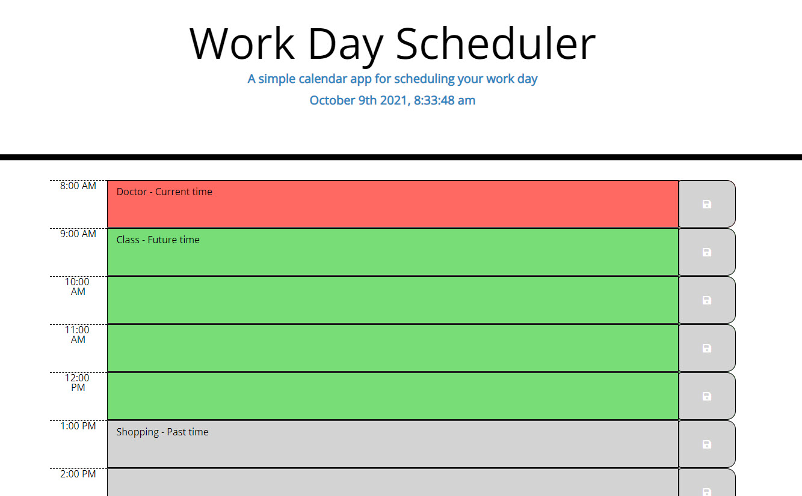

# Third Party API Work Day Scheduler

## Description
In this project I completed a simple work day calendar application that allows a user to save events for each hour of the day by modifying starter code. This app will run in the browser and feature dynamically updated HTML and CSS powered by jQuery.

# Expected Criteria

When I open the planner the current day is displayed at the top of the calendar

When I scroll down I am presented with timeblocks for standard business hours

When I view the timeblocks for that day each timeblock is color coded to indicate whether it is in the past, present, or future

WhenI click into a timeblock I can enter an event and click the save button for that timeblock so the event is saved in local storage

When I refresh the page the saved events persist 

# Screenshot

# Deployed Link

https://lindamart.github.io/third_party_api_workdayscheduler/

# Credits

W3 Schools: https://www.w3schools.com/

MDN Web Docs: https://developer.mozilla.org/en-US

Bootstrap: https://getbootstrap.com/

jQuery: https://api.jquery.com/

Moment.js: https://momentjs.com/